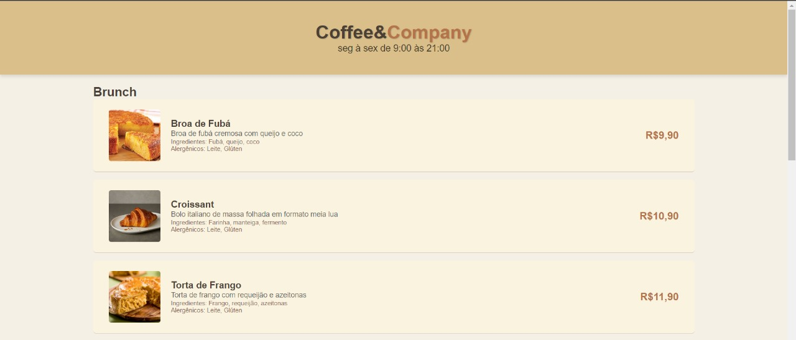

# Cofee&Company
Coffee&Company é uma cafeteria moderna dedicada a proporcionar uma experiência única para os amantes de café e de ambientes acolhedores. Com um ambiente sofisticado e confortável, a Coffee & Company combina o melhor do café artesanal com um menu variado de delícias culinárias, criando o local perfeito para relaxar, trabalhar ou se encontrar com amigos.



## Descrição

O site oferece uma visualização clara e atraente do cardápio da cafeteria, permitindo que os clientes vejam os itens disponíveis, suas descrições e preços. O design é responsivo e adaptável a diferentes tamanhos de tela, garantindo uma experiência de usuário agradável em dispositivos móveis e desktops.

## Tecnologias Utilizadas

- **HTML**: Estruturação do conteúdo do cardápio.
- **CSS**: Estilização e design responsivo.

## Funcionalidades

- **Visualização do Cardápio**: Apresenta itens do cardápio com descrição e preços.
- **Design Responsivo**: Adapta-se a diferentes tamanhos de tela.
- **Layout Limpo e Intuitivo**: Navegação simples e clara.

## Instalação e Execução

1. **Clone o Repositório**:
   ```bash
   git clone https://github.com/SEU_USUARIO/NOME_DO_REPOSITORIO.git
